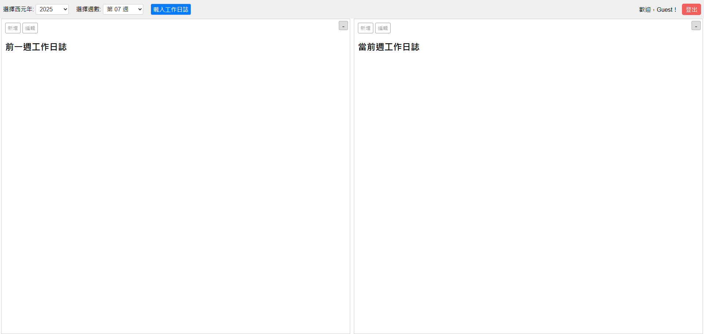
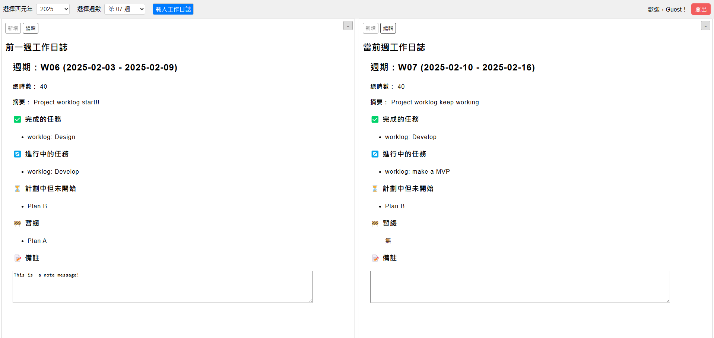
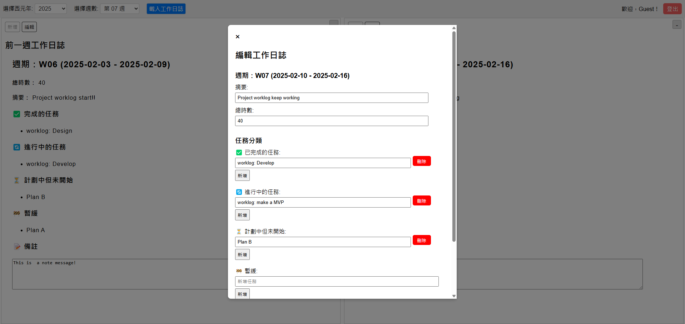

# WorkTrace

WorkTrace 是一個輕量的工作日誌管理工具，幫助個人與團隊記錄、檢視與追蹤工作進度。

作為最小可行性產品（minimum viable product, MVP），WorkTrace 提供簡單的帳號登入、工作日誌新增與修改功能，並支援左右分割畫面比較當前與上周日誌。未來將推出群組協作、管理團隊與進度追蹤等進階功能。

## 核心功能
- 帳號密碼登入（含測試帳號體驗，每次登入初始化資料）
- 工作日誌的新增、檢視與修改
- 左右分割畫面比較當前與上周日誌（可切換全螢幕檢視）
- 基於 .jsonl 檔案的輕量資料存取（未來將區分免費/付費版）

## 未來規劃
- 日誌匯出
- 群組功能：成員間共享與檢視工作日誌
- 管理團隊功能：
  - 上層檢視與分派工作
  - 即時訊息通知
- Dashboard：專案進度一覽與追蹤

## 安裝方式

### Web Service + Php

使用任何支援 PHP 的 Web 伺服器（例如 Apache、Nginx、IIS 等），將專案目錄置於根目錄即可透過瀏覽器訪問。

### Php Only

如果你只有 php 使用 PHP 內建的開發伺服器
```
php -S localhost:8000 -t /path/to/your/website
```
然後在瀏覽器訪問 http://localhost:8000

測試用的帳號/密碼為 demouser/demouser

測試資料為 
- 2024 年 w52
- 2025 年 w01 ~ w07

## 介面說明

### 登入畫面


### 登入後的畫面



### 載入工作日誌



### 新增與編輯



## 聯繫我們

有任何合作、建議或問題？請透過 [kqletonline@gmail.com](mailto:kqletonline@gmail.com) 聯繫我！